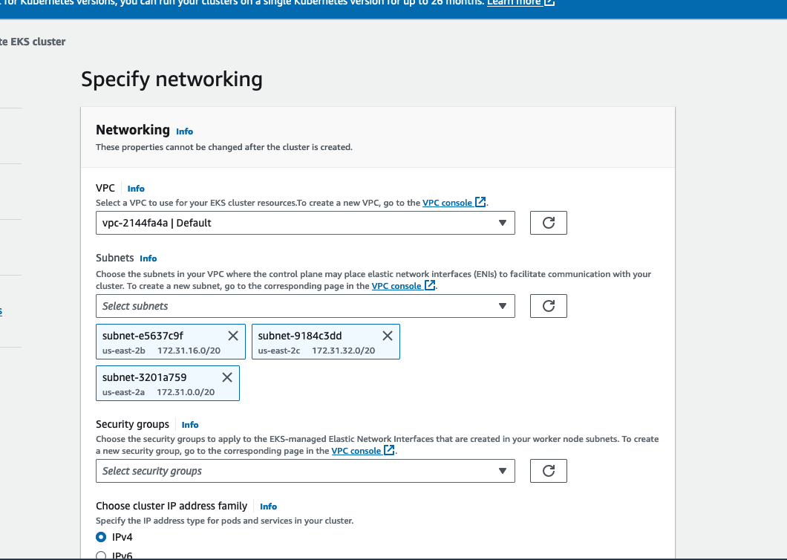

# How to setup an auto-scaling cluster in Elastic Kubernetes Service

> This guide was migrated from my old blog.

I've used this guide to build three production-grade auto-scaling clusters in AWS EKS.
These clusters can scale to hundreds of nodes and thousands of pods running at a time
in a matter of minutes. I've found that this setup lends itself nicely to
heavy data-processing and machine learning workflows. Which most companies tend to do
these days.

For the most part, this guide uses the AWS console to setup everything, which has its trade-offs.

This guide assumes that you have kubectl and aws-cli-v2 installed on your machine.

## Create the Cluster

Navigate to the EKS Clusters page and click Add cluster -> Create.


On the next page, give your cluster a name, select a kubernetes version (I used 1.27), and
select the Cluster Service Role.

If you don't have a Cluster Service Role yet, it's pretty easy to create one following aws's
linked guide, but TLDR; just create an IAM role and attach the policy: `AmazonEKSClusterPolicy` to it.
This should be the only policy needed. The json below the screenshot includes what that policy looks like.
This is just default stuff.


```json
{
  "Version": "2012-10-17",
  "Statement": [
    {
      "Effect": "Allow",
      "Action": [
        "autoscaling:DescribeAutoScalingGroups",
        "autoscaling:UpdateAutoScalingGroup",
        "ec2:AttachVolume",
        "ec2:AuthorizeSecurityGroupIngress",
        "ec2:CreateRoute",
        "ec2:CreateSecurityGroup",
        "ec2:CreateTags",
        "ec2:CreateVolume",
        "ec2:DeleteRoute",
        "ec2:DeleteSecurityGroup",
        "ec2:DeleteVolume",
        "ec2:DescribeInstances",
        "ec2:DescribeRouteTables",
        "ec2:DescribeSecurityGroups",
        "ec2:DescribeSubnets",
        "ec2:DescribeVolumes",
        "ec2:DescribeVolumesModifications",
        "ec2:DescribeVpcs",
        "ec2:DescribeDhcpOptions",
        "ec2:DescribeNetworkInterfaces",
        "ec2:DescribeAvailabilityZones",
        "ec2:DetachVolume",
        "ec2:ModifyInstanceAttribute",
        "ec2:ModifyVolume",
        "ec2:RevokeSecurityGroupIngress",
        "ec2:DescribeAccountAttributes",
        "ec2:DescribeAddresses",
        "ec2:DescribeInternetGateways",
        "ec2:DescribeInstanceTopology",
        "elasticloadbalancing:AddTags",
        "elasticloadbalancing:ApplySecurityGroupsToLoadBalancer",
        "elasticloadbalancing:AttachLoadBalancerToSubnets",
        "elasticloadbalancing:ConfigureHealthCheck",
        "elasticloadbalancing:CreateListener",
        "elasticloadbalancing:CreateLoadBalancer",
        "elasticloadbalancing:CreateLoadBalancerListeners",
        "elasticloadbalancing:CreateLoadBalancerPolicy",
        "elasticloadbalancing:CreateTargetGroup",
        "elasticloadbalancing:DeleteListener",
        "elasticloadbalancing:DeleteLoadBalancer",
        "elasticloadbalancing:DeleteLoadBalancerListeners",
        "elasticloadbalancing:DeleteTargetGroup",
        "elasticloadbalancing:DeregisterInstancesFromLoadBalancer",
        "elasticloadbalancing:DeregisterTargets",
        "elasticloadbalancing:DescribeListeners",
        "elasticloadbalancing:DescribeLoadBalancerAttributes",
        "elasticloadbalancing:DescribeLoadBalancerPolicies",
        "elasticloadbalancing:DescribeLoadBalancers",
        "elasticloadbalancing:DescribeTargetGroupAttributes",
        "elasticloadbalancing:DescribeTargetGroups",
        "elasticloadbalancing:DescribeTargetHealth",
        "elasticloadbalancing:DetachLoadBalancerFromSubnets",
        "elasticloadbalancing:ModifyListener",
        "elasticloadbalancing:ModifyLoadBalancerAttributes",
        "elasticloadbalancing:ModifyTargetGroup",
        "elasticloadbalancing:ModifyTargetGroupAttributes",
        "elasticloadbalancing:RegisterInstancesWithLoadBalancer",
        "elasticloadbalancing:RegisterTargets",
        "elasticloadbalancing:SetLoadBalancerPoliciesForBackendServer",
        "elasticloadbalancing:SetLoadBalancerPoliciesOfListener",
        "kms:DescribeKey"
      ],
      "Resource": "*"
    },
    {
      "Effect": "Allow",
      "Action": "iam:CreateServiceLinkedRole",
      "Resource": "*",
      "Condition": {
        "StringEquals": {
          "iam:AWSServiceName": "elasticloadbalancing.amazonaws.com"
        }
      }
    }
  ]
}
```

Moving onto networking, you can leave all of these settings as the default.

You’ll also want to ensure that Cluster endpoint access is Public.

You don't need to worry about the Security Groups field, aws will generate one
automatically and we will mess with it later.



Next, configure logging. I want all the logs.


Select add-ons, should look like this:


You can leave the defaults for the add-ons.


After reviewing, click create!


The cluster will be in a Creating state for several minutes.
But once the Cluster security group becomes available, click on the security group link.
It will bring you to the Security Groups page.


The name for this security group is auto-generated and the first inbound/outbound rules are auto-generated.
If you want, you can whitelist IP’s here so that those IP’s can ssh into the nodes.

Even if the node groups' launch templates have remote access configured,
you still need to whitelist IP’s for the cluster’s security group otherwise
you won’t be able to connect (or ssh into the nodes).

Open up a terminal, and let's check that you can see the cluster.

```bash
aws eks list-clusters
```

You should see something like

```bash
jack@Jacks-MBP-2 ~ % aws eks list-clusters

{
  "clusters": [
    "my-cluster-name"
  ]
}
```

That's it, you successfully created a Kubernetes cluster in EKS. Here's a ⭐
But, we've only just begun...

## Access the Cluster Locally

Now we can add the cluster to our local kubeconfig. In your terminal run:

```bash
aws eks update-kubeconfig --region us-east-2 --name my-cluster-name
```

Don't worry if you don't have a kubeconfig, this command will create one for you.
This command will automatically switch to the cluster's context.

Let's just double check that the cluster was added and that our current context
points to it:

```bash
kubectl config get-contexts

CURRENT NAME   AUTHINFO       CLUSTER           NAMESPACE
*       arn:aws:eks:us-east-2:598028:cluster/my-cluster-name arn:aws:eks:us-east-2:598028:cluster/my-cluster-name ...
```

Also, verify the cluster-info command:

```bash
kubectl cluster-info

Kubernetes control plane is running at https://4839483928490.gr7.us-east-2.eks.amazonaws.com
CoreDNS is running at https://4839483928490.gr7.us-east-2.eks.amazonaws.com/api/v1/namespaces/kube-system/services/kube-dns:dns/proxy

To further debug and diagnose cluste problems, use 'kubectl cluster-info dump'.
```

If you see an error like:

```bash
error: exec plugin: invalid apiVersion "client.authentication.k8s.io/v1alpha1"
```

You probably have an old version of the aws cli installed or perhaps an incompatible
kube client. I recommend [upgrading to awscliv2](https://docs.aws.amazon.com/cli/latest/userguide/getting-started-install.html).

By default, the user or role that created the cluster is the only IAM entity that
has access. Kubernetes has its own permission model, so you need to add additional
users/roles manually. Not necessary to do now, but will be once your teammates
or coworkers need to access it. I'll show how to do this towards the end of this guide.

## Create Node Role

We are going to need an iam role that we can attach to node groups in our cluster.

Navigate to the IAM roles page and click Create role.


Choose **Custom trust policy** under **Select trusted entity** and copy the following policy into
the editor.

```json
{
  "Version": "2012-10-17",
  "Statement": [
    {
      "Effect": "Allow",
      "Principal": {
        "Service": "ec2.amazonaws.com"
      },
      "Action": "sts:AssumeRole"
    }
  ]
}
```


Then, add the following policies:

```
AmazonEC2ContainerRegistryReadOnly
AmazonEKS_CNI_Policy
AmazonEKSWorkerNodePolicy
```

If you want to add customer-defined policies you can add those here as well.
For example, you may want to give the nodes read-only access to an s3 bucket.

You can simply search for and check the policy names.


When you're finished attaching policies, click next, give the role a name and description,
and then click Create. Remember the node role's name as we will be attaching it to node groups
later in this guide.

## Add a Node Group

Now we are going to add a node group, which will house what I like to call our "admin"
pods.

Navigate to your cluster in EKS and click on the **Compute** tab. Then click on **Add node group**.


On the configure page, name the node group: `admin-node-group` and, using the iam role we created earlier,
assign the role under the **Node IAM role** part.


You don’t need to add any Kubernetes labels or taints to this node group so once you’ve filled the name and the role, click Next.

In the compute configuration, follow this spec:

```
AMI type: Amazon Linux 2 Arm
Capacity type: On-Demand
Instance type: t4g.large
Disk size: 20GiB
```


For the scaling config, follow this spec:

```
Desired size: 1
Minimum size: 1
Maximum size: 2
```


You can keep the defaults for the "Update configuration". Click Next.

For the network config, if you want to allow remote access to nodes, you can set that up here.
Just choose the proper ec2 key pair and security groups. You can also generate these pretty easily
to add your IP to the allowlist.


Click next when you're finished. The node group will be in a creating state for a few minutes.

Once it's done creating, we should see some nodes in our cluster:

```bash
kubectl get nodes

NAME                                            STATUS    ROLES    AGE    VERSION
ip-172-31-18-97.us-east-2.compute.internal      Ready     <none>   3m29s  v1.27.5-eks-43840fb
```

Now take this yml and stick it in a file called: `hello-world-job.yml`.

```json
apiVersion: batch/v1
kind: Job
metadata:
  name: hello-world-job
spec:
  template:
    spec:
      restartPolicy: Never
      containers:
      - name: hello-world
        image: hello-world
```

Then, let's run our job:

```bash
kubectl apply -f hello-world-job.yml
```

Then let's check on our job:

```bash
kubectl get jobs

NAME              COMPLETIONS   DURATION    AGE
hello-world-job   0/1           3s          3s
```

If you're feeling excited, you can check the logs and detailed status of the job.

```bash
kubectl logs jobs/hello-world-job

Hello from Docker!
This message shows that your installation appears to be working correctly.

To generate this message, Docker took the following steps:
 1. The Docker client contacted the Docker daemon.
 2. The Docker daemon pulled the "hello-world" image from the Docker Hub.
    (amd64)
 3. The Docker daemon created a new container from that image which runs the
    executable that produces the output you are currently reading.
 4. The Docker daemon streamed that output to the Docker client, which sent it
    to your terminal.
...

kubectl describe job hello-world-job
```

Congrats on attaching some nodes to your cluster. In theory, you could attempt
to schedule some of your containerized workflows/scripts/apps with this setup.
Though, they are likely to be evicted if they are resource heavy.

It'd be funner if we setup auto-scaling node groups as well.

## Setup Cluster Auto-Scaler (CA)

Companies often need to run resource intense workloads, requiring hundreds of GiB of RAM,
terabytes of ephemeral storage, even gpu's. Such is the case for tasks processing lots of data
or machine learning workflows.

But nodes that satisfy these requirements are EXPENSIVE. Ideally, we would like to "request"
such nodes based on our workflows, scaling from 0 to N and back to 0 with no manual effort.

Luckily, a Cluster Auto-Scaler can help us out. The CA will dynamically add or remove nodes
based on the cluster's workload.

Using Kubernetes labels, we will target specific node groups for our jobs. If there are 0 nodes
running in that node group or work cannot be scheduled on existing nodes, then the cluster should
increase the number of nodes in that node group (scale out). Inversely, once jobs start to be completed,
the cluster should remove any unused nodes (scale in).

To start, we need to create an IAM policy. It'll allow the cluster to provision and tear down nodes
"owned" by the cluster. Technically, you only need to attach this policy to the node that will
be running the CA, for instance, you might only attach this policy to the node role associated with the admin node group.
But to keep the guide simpler, we're just going to attach this policy to the node role we've already created
and use that role for all of our node groups.

Navigate to the IAM dashboard in the aws console and select Policies.
Click Create Policy and copy this policy into the policy editor, updating the condition
with the name of your cluster.

```json
{
  "Version": "2012-10-17",
  "Statement": [
    {
      "Action": [
        "autoscaling:DescribeAutoScalingGroups",
        "autoscaling:DescribeAutoScalingInstances",
        "autoscaling:DescribeLaunchConfigurations",
        "autoscaling:DescribeTags",
        "ec2:DescribeInstanceTypes",
        "ec2:DescribeLaunchTemplateVersions"
      ],
      "Resource": "*",
      "Effect": "Allow"
    },
    {
      "Action": [
        "autoscaling:SetDesiredCapacity",
        "autoscaling:TerminateInstanceInAutoScalingGroup",
        "autoscaling:UpdateAutoScalingGroup",
        "ec2:DescribeImages",
        "ec2:GetInstanceTypesFromInstanceRequirements",
        "eks:DescribeNodegroup"
      ],
      "Resource": "*",
      "Effect": "Allow",
      "Condition": {
        "StringEquals": {
          "autoscaling:ResourceTag/kubernetes.io/cluster/my-cluster-name": "owned"
        }
      }
    }
  ]
}
```

Give the policy a name, something like `my-cluster-name-k8s-cluster-autoscaler-policy`,
description, and create it.

We need to attach this policy to the node role we created previously.

Navigate to the IAM roles and find the node role you created.
Click on the node role, then Add Permissions, then Attach Policies. Search for the policy name
`my-cluster-name-k8s-cluster-autoscaler-policy` and then click Add Permissions.

Once you attach the policy, you should see it appear under the Permission policies for the node role,
after you are redirected.

Now we are going to create a Deployment, ServiceAccount, and some bindings to get the CA running.

The manifest we are going to use was pulled from the [Kubernetes Cluster-AutoScaler repo](https://github.com/kubernetes/autoscaler/blob/master/cluster-autoscaler/cloudprovider/aws/examples/cluster-autoscaler-autodiscover.yaml).

Be sure to update 'YOUR_CLUSTER_NAME_HERE' with the actual name of your cluster.

```yaml
---
apiVersion: v1
kind: ServiceAccount
metadata:
  labels:
    k8s-addon: cluster-autoscaler.addons.k8s.io
    k8s-app: cluster-autoscaler
  name: cluster-autoscaler
  namespace: kube-system
---
apiVersion: rbac.authorization.k8s.io/v1
kind: ClusterRole
metadata:
  name: cluster-autoscaler
  labels:
    k8s-addon: cluster-autoscaler.addons.k8s.io
    k8s-app: cluster-autoscaler
rules:
  - apiGroups: [""]
    resources: ["events", "endpoints"]
    verbs: ["create", "patch"]
  - apiGroups: [""]
    resources: ["pods/eviction"]
    verbs: ["create"]
  - apiGroups: [""]
    resources: ["pods/status"]
    verbs: ["update"]
  - apiGroups: [""]
    resources: ["endpoints"]
    resourceNames: ["cluster-autoscaler"]
    verbs: ["get", "update"]
  - apiGroups: [""]
    resources: ["nodes"]
    verbs: ["watch", "list", "get", "update"]
  - apiGroups: [""]
    resources:
      - "namespaces"
      - "pods"
      - "services"
      - "replicationcontrollers"
      - "persistentvolumeclaims"
      - "persistentvolumes"
    verbs: ["watch", "list", "get"]
  - apiGroups: ["extensions"]
    resources: ["replicasets", "daemonsets"]
    verbs: ["watch", "list", "get"]
  - apiGroups: ["policy"]
    resources: ["poddisruptionbudgets"]
    verbs: ["watch", "list"]
  - apiGroups: ["apps"]
    resources: ["statefulsets", "replicasets", "daemonsets"]
    verbs: ["watch", "list", "get"]
  - apiGroups: ["storage.k8s.io"]
    resources:
      ["storageclasses", "csinodes", "csidrivers", "csistoragecapacities"]
    verbs: ["watch", "list", "get"]
  - apiGroups: ["batch", "extensions"]
    resources: ["jobs"]
    verbs: ["get", "list", "watch", "patch"]
  - apiGroups: ["coordination.k8s.io"]
    resources: ["leases"]
    verbs: ["create"]
  - apiGroups: ["coordination.k8s.io"]
    resourceNames: ["cluster-autoscaler"]
    resources: ["leases"]
    verbs: ["get", "update"]
---
apiVersion: rbac.authorization.k8s.io/v1
kind: Role
metadata:
  name: cluster-autoscaler
  namespace: kube-system
  labels:
    k8s-addon: cluster-autoscaler.addons.k8s.io
    k8s-app: cluster-autoscaler
rules:
  - apiGroups: [""]
    resources: ["configmaps"]
    verbs: ["create", "list", "watch"]
  - apiGroups: [""]
    resources: ["configmaps"]
    resourceNames:
      ["cluster-autoscaler-status", "cluster-autoscaler-priority-expander"]
    verbs: ["delete", "get", "update", "watch"]

---
apiVersion: rbac.authorization.k8s.io/v1
kind: ClusterRoleBinding
metadata:
  name: cluster-autoscaler
  labels:
    k8s-addon: cluster-autoscaler.addons.k8s.io
    k8s-app: cluster-autoscaler
roleRef:
  apiGroup: rbac.authorization.k8s.io
  kind: ClusterRole
  name: cluster-autoscaler
subjects:
  - kind: ServiceAccount
    name: cluster-autoscaler
    namespace: kube-system

---
apiVersion: rbac.authorization.k8s.io/v1
kind: RoleBinding
metadata:
  name: cluster-autoscaler
  namespace: kube-system
  labels:
    k8s-addon: cluster-autoscaler.addons.k8s.io
    k8s-app: cluster-autoscaler
roleRef:
  apiGroup: rbac.authorization.k8s.io
  kind: Role
  name: cluster-autoscaler
subjects:
  - kind: ServiceAccount
    name: cluster-autoscaler
    namespace: kube-system

---
apiVersion: apps/v1
kind: Deployment
metadata:
  name: cluster-autoscaler
  namespace: kube-system
  labels:
    app: cluster-autoscaler
spec:
  replicas: 1
  selector:
    matchLabels:
      app: cluster-autoscaler
  template:
    metadata:
      labels:
        app: cluster-autoscaler
      annotations:
        prometheus.io/scrape: "true"
        prometheus.io/port: "8085"
    spec:
      priorityClassName: system-cluster-critical
      securityContext:
        runAsNonRoot: true
        runAsUser: 65534
        fsGroup: 65534
        seccompProfile:
          type: RuntimeDefault
      serviceAccountName: cluster-autoscaler
      containers:
        - image: registry.k8s.io/autoscaling/cluster-autoscaler:v1.26.2
          name: cluster-autoscaler
          resources:
            limits:
              cpu: 100m
              memory: 600Mi
            requests:
              cpu: 100m
              memory: 600Mi
          command:
            - ./cluster-autoscaler
            - --v=4
            - --stderrthreshold=info
            - --cloud-provider=aws
            - --skip-nodes-with-local-storage=false
            - --expander=least-waste
            - --node-group-auto-discovery=asg:tag=k8s.io/cluster-autoscaler/enabled,k8s.io/cluster-autoscaler/YOUR_CLUSTER_NAME_HERE
          volumeMounts:
            - name: ssl-certs
              mountPath: /etc/ssl/certs/ca-certificates.crt # /etc/ssl/certs/ca-bundle.crt for Amazon Linux Worker Nodes
              readOnly: true
          imagePullPolicy: "Always"
          securityContext:
            allowPrivilegeEscalation: false
            capabilities:
              drop:
                - ALL
            readOnlyRootFilesystem: true
      volumes:
        - name: ssl-certs
          hostPath:
            path: "/etc/ssl/certs/ca-bundle.crt"
```

**By default, this cluster auto-scaler is configured to scale-down after 10 minutes.**

Update the manifest to include the name of your cluster, save it to a file, and apply it.

```bash
kubectl apply -f cluster-autoscale-autodiscover.yml
```

Good idea to check the status of the CA:

```bash
kubectl get deployments/cluster-autoscaler -n kube-system

NAME                 READY   UP-TO-DATE   AVAILABLE   AGE
cluster-autoscaler   1/1     1            1           30s
```

## Add an Auto-Scaleable Node Group

Time to create a node group that can scale from 0 to N back to 0.

We've already created our admin-node-group, this process will look pretty similar, but
we'll be adding some Kubernetes Labels and tagging the node group's auto scaling group.

Navigate to your cluster in eks via the aws console. Click **Add node group**.

Give the node group a name and use the node role we created earlier in this guide.
In a production setting you will likely want a node role dedicated to worker/data processing nodes.

You can keep the rest of the settings the same, scroll down to the Kubernetes Labels section.

Add the following label:

```bash
compute: my-node-group
```


Technically, it doesn't have to be these labels exactly. Just any sensible key-value pair.
Just remember whatever key value pair you choose as we'll need it when tagging auto-scaling groups.

Click next.

In the compute configuration section, you can follow this spec, although, you should
select the instance type based on your task's requirements.

```yaml
AMI type: Amazon Linux 2
Capacity type: On-Demand
Instance types: c5d.9xlarge
Disk Size: 20 GiB
```

In the scaling config, set Desired size to 0 and Minimum size to 0.
We also choose an arbitrary Maximum Node Size of 50. But this should be tuned based on your requirements.


Click next after setting the scaling config, then next again in networking keeping defaults,
then review, then CREATE.

After you create the node group, an Autoscaling group will be pending creation.
Once the Autoscaling group is created, click on the name.


When you get to the page for the ASG, scroll down to the tags section.

Since we have a cluster autoscaler already setup in our cluster, aws automatically adds some tags to this ASG so that the CA can make informed decisions
during scale-related events.

**BUT!!** There are some tags missing…

Since we use Kubernetes labels to target node groups, the ASG for said node group must have respective tags of those labels.

Since we only defined 1 Kubernetes label when we were setting up our node group we only have to add 1 additional tag.
But if you add N Kubernetes labels then you would need to add N tags to the corresponding ASG.

Go ahead and click the **Edit** button and then **Add Tag.**

We are going to add a new key-value pair that takes the following form:

```bash
Key: k8s.io/cluster-autoscaler/node-template/label/<KEY_OF_K8S_LABEL>
Value: <VALUE_OF_K8S_LABEL>
```

Which in our case we will add:

```bash
Key: k8s.io/cluster-autoscaler/node-template/label/compute
Value: my-node-group
```

Nice, now that we have our auto-scaling node group set up. We can really see our cluster come to life.

## Suspend Availability Zone Re-Balancing (optional)

By default, Autoscaling Groups in AWS are setup with multiple availabilty zones. And thus, by default, during scale down events, the ASG may
terminate nodes in that node group in order to keep the availability zones "in balanace". This may make sense for some application workflows
but for our case, we are mostly focused on batch jobs (data-processing and ml training).

We don't really care where they run as long as they run as soon as possible.

If you don't suspend AZ rebalancing you may notice that some in-use nodes are "evicted" without much trace of why
specifically when the cluster auto-scaler has terminated nodes that were no longer needed.

Use this command to suspend AZ rebalancing

```bash
aws autoscaling suspend-processes \
--auto-scaling-group-name <YOUR_ASG_NAME> \
--scaling-processes AZRebalance

# for example
aws autoscaling suspend-processes \
--auto-scaling-group-name my-node-group \
--scaling-processes AZRebalance
```

To verify that it has been suspended you can try:

```bash
aws autoscaling describe-auto-scaling-groups \
--auto-scaling-group-names <YOUR_ASG_NAME> \
--query "AutoScalingGroups[*].{Name:AutoScalingGroupName, SuspendedProcesses:SuspendedProcesses}"
```

And if you want to check the availability zones for your node group:

```bash
aws autoscaling describe-auto-scaling-groups \
--auto-scaling-group-names <YOUR_ASG_NAME> \
--query "AutoScalingGroups[*].[AutoScalingGroupName, AvailabilityZones]"
```

Nice, now the node group is in a much more reliable spot.

## Schedule a Job and Watch Cluster Auto-Scaler Go BRRRRR

Now it is time to scale up!!

At present, there should be 0 nodes in the node group: "my-node-group".

Copy the yml below, save it to `hello-autoscaling.yml` and notice
the `nodeSelector` part. We are specifically targeting the node group we
created previously in this guide.

```json
apiVersion: batch/v1
kind: Job
metadata:
  name: hello-autoscaling
spec:
  template:
    spec:
      nodeSelector:
        compute: my-node-group
      restartPolicy: Never
      containers:
      - name: hello-autoscaling
        image: hello-world
```

Apply it with `kubectl apply -f hello-autoscaling.yml`.

Then describe the job and find the pod that was created

```bash
kubectl describe job hello-autoscaling

...

Pods Statuses:    1 Active (0 Ready) / 0 Succeeded / 0 Failed
Pod Template:
  Labels:  batch.kubernetes.io/controller-uid=637e3272-6ede-44f2-80f1-753f4cd4f874
           batch.kubernetes.io/job-name=hello-autoscaling
           controller-uid=637e3272-6ede-44f2-80f1-753f4cd4f874
           job-name=hello-autoscaling
  Containers:
   hello-autoscaling:
    Image:        hello-world
    Port:         <none>
    Host Port:    <none>
    Environment:  <none>
    Mounts:       <none>
  Volumes:        <none>
Events:
  Type    Reason            Age   From            Message
  ----    ------            ----  ----            -------
  Normal  SuccessfulCreate  17s   job-controller  Created pod: hello-autoscaling-z9t9j
```

Then describe the pod

```bash
kubectl describe pod hello-autoscaling-z9t9j

...

QoS Class:                   BestEffort
Node-Selectors:              compute=my-node-group
Tolerations:                 node.kubernetes.io/not-ready:NoExecute op=Exists for 300s
                             node.kubernetes.io/unreachable:NoExecute op=Exists for 300s
Events:
  Type     Reason            Age   From                Message
  ----     ------            ----  ----                -------
  Warning  FailedScheduling  91s   default-scheduler   0/5 nodes are available: 5 node(s) didn't match Pod's node affinity/selector. preemption: 0/5 nodes are available: 5 Preemption is not helpful for scheduling..
  Normal   TriggeredScaleUp  88s   cluster-autoscaler  pod triggered scale-up: [{eks-my-node-group-ecc5b3d1-f911-10e7-508d-0f2a93f8606c 0->1 (max: 50)}]
  Normal   Scheduled         49s   default-scheduler   Successfully assigned default/hello-autoscaling-z9t9j to ip-172-31-12-39.us-east-2.compute.internal
  Normal   Pulling           48s   kubelet             Pulling image "hello-world"
  Normal   Pulled            48s   kubelet             Successfully pulled image "hello-world" in 642.257205ms (642.278334ms including waiting)
  Normal   Created           48s   kubelet             Created container hello-autoscaling
  Normal   Started           48s   kubelet             Started container hello-autoscaling
```

Look at that! The cluster-autoscaler is doing its job!.

This is a common event pattern during scale up events. First, a `FailedScheduling` event
will occur since the scheduler cannot find any suitable nodes to schedule the pod on.
Then the cluster-autoscaler triggers a scale up allowing the scheduler to schedule
the pod.

10 minutes after the pod `hello-autoscaling-z9t9j` enters a completed state
the cluster-autoscaler will mark that node as un-scheduleable and it will be removed
from the cluster, assuming no other jobs are scheduled on it before that 10 minute window.

## Setup aws-auth Config Map (optional)

When you create a cluster in EKS, only your IAM user/role has access to the cluster.
This can be a problem if your teammates also need access to the cluster. This is because,
at the time of writing, kubernetes maintains its own permissions model. Even if your teammates
have 'god-mode' access in aws, you will still need to give them explicit access to the cluster via
a kubernetes ConfigMap.

First, make sure you have the userarn and username for the account you want to give access to.

```bash
userarn: arn:aws:iam:438902:user/myteammate
username: myteammate
```

Then pull the current aws-auth config map

```bash
kubectl get configmap aws-auth -n kube-system -o yaml > aws-auth-latest.yml
```

Open the config map aws-auth-latest.yml and it will look like:

```yml
apiVersion: v1
data:
  mapRoles: |
    - groups:
      - system:bootstrappers
      - system:nodes
      rolearn: arn:aws:iam::438902:role/AmazonEKSNodeRole
      username: system:node:{{EC2PrivateDNSName}}
kind: ConfigMap
metadata:
  annotations:
    kubectl.kubernetes.io/last-applied-configuration: |
      {"apiVersion":"v1","data":{"mapRoles":"- groups:\n ... "}}
  creationTimestamp: "2023-07-13T17:50:15Z"
  name: aws-auth
  namespace: kube-system
  resourceVersion: "89144844"
  uid: e9622ceb-be09-452a-9d2a-b98d71b75af9
```

Not much going on yet, but we can easily add a user to the map. Under data, add a `mapUsers`
key and add your teammate as an entry.

In this example we are adding the user to the system:masters group which basically
gives god-mode access to our cluster. Make sure you only give your teammate
the permissions they really need.

```yml
apiVersion: v1
data:
  mapRoles: |
    - groups:
      - system:bootstrappers
      - system:nodes
      rolearn: arn:aws:iam::438902:role/AmazonEKSNodeRole
      username: system:node:{{EC2PrivateDNSName}}
  mapUsers: |
    - userarn: arn:aws:iam:438902:user/myteammate
      username: myteammate
      groups:
        - system:masters
kind: ConfigMap
metadata:
  annotations:
    kubectl.kubernetes.io/last-applied-configuration: |
      {"apiVersion":"v1","data":{"mapRoles":"- groups:\n ... "}}
  creationTimestamp: "2023-07-13T17:50:15Z"
  name: aws-auth
  namespace: kube-system
  resourceVersion: "89144844"
  uid: e9622ceb-be09-452a-9d2a-b98d71b75af9
```

Apply this manifest to give your teammate access.

```bash
kubectl apply -f aws-auth-latest.yml
```

## Conclusion

This is a pretty simple setup of an autoscaling eks cluster -- it can support
about 100 nodes per node group, anymore than that and you will likely see some performance
issues with the cluster-autoscaler. If your needs go beyond this you may want to consider having an autoscaler per node group.

Other than that, I'd recommend making observability a priority, and install prometheus/grafana.

Congrats on making it to the end of this guide. I'm proud of you.
Here's some stars: ⭐ ⭐ ⭐
